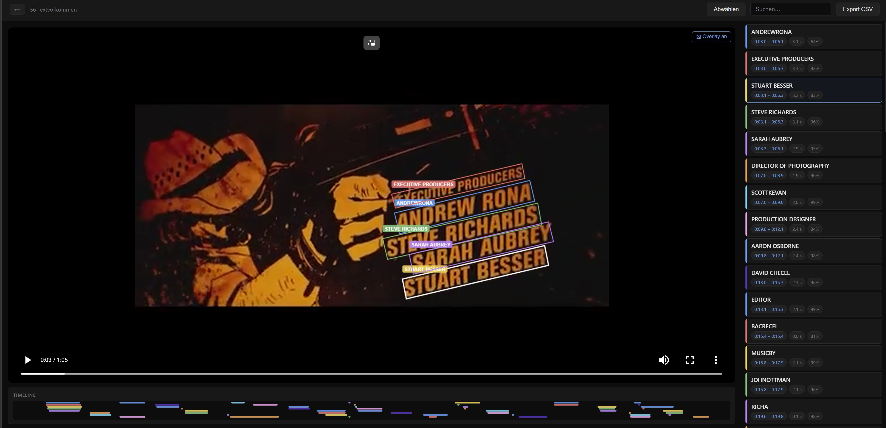

# SceneOCR — Video Text Analyzer

Extracts, tracks, and exports on-screen text from videos. Runs fully locally — no cloud, no API keys.

**[Download v1.1.0 for Windows →](https://github.com/chris-j-weber/SceneOCR/releases/tag/v1.1.0)**
Unzip and run the `.exe` — no installation required.



## Features

- Automatic OCR on video frames using [RapidOCR](https://github.com/RapidAI/RapidOCR) (ONNX Runtime)
- Three analysis modes: Fast (1 fps) · Accurate (two-pass) · Maximum (native fps detail pass)
- Bounding-box overlay on the video player, synced to playback time
- Editable text tracks and timestamps
- Merge, delete, and search across all detected text occurrences
- Project save/reopen — results are stored locally in the browser
- CSV export of all text occurrences
- GPU acceleration auto-detected at runtime (NVIDIA CUDA → Apple CoreML → CPU)

## Stack

| Layer    | Technology                          |
|----------|-------------------------------------|
| Frontend | React 18 + TypeScript + Vite        |
| Backend  | FastAPI + Python 3.11               |
| OCR      | RapidOCR (ONNX Runtime)             |
| Video    | FFmpeg (frame extraction)           |
| Deploy   | Docker Compose                      |

## Quick Start

### With Docker (recommended)

```bash
# CPU (default — works everywhere)
docker compose up --build

# NVIDIA GPU — requires CUDA 12 + cuDNN 9 on the host
docker compose -f docker-compose.yml -f docker-compose.gpu.yml up --build
```

Open [http://localhost:5173](http://localhost:5173).

### Without Docker (local dev)

**Backend:**
```bash
cd backend
python -m venv .venv
source .venv/bin/activate        # Windows: .venv\Scripts\activate
pip install rapidocr-onnxruntime
pip install -r requirements.txt
uvicorn main:app --reload --port 8000
```

For NVIDIA GPU acceleration, replace `onnxruntime` with `onnxruntime-gpu` after installing:
```bash
pip uninstall onnxruntime
pip install onnxruntime-gpu
```

**Frontend:**
```bash
cd frontend
npm install
npm run dev
```

## GPU Support

GPU acceleration is detected automatically at runtime:

| Hardware        | Provider                  | How to enable                            |
|-----------------|---------------------------|------------------------------------------|
| NVIDIA GPU      | CUDAExecutionProvider     | Install `onnxruntime-gpu`                |
| Apple Silicon   | CoreMLExecutionProvider   | Use standard `onnxruntime` (macOS only)  |
| CPU (default)   | CPUExecutionProvider      | Always available as fallback             |

The detected provider is printed to the backend logs at startup:
```
[OCR] Using CUDA GPU acceleration
```

## Project structure

```
backend/
  main.py          FastAPI app + endpoints
  pipeline.py      Two-pass video analysis pipeline
  extractor.py     FFmpeg frame extraction
  recognizer.py    RapidOCR wrapper with GPU detection
  grouper.py       Merge per-frame detections into text tracks

frontend/src/
  App.tsx          Root app + routing (home / upload / analyze / results)
  db.ts            Project persistence (localStorage)
  components/
    HomePage.tsx      Saved projects + new project card
    UploadPage.tsx    Video drop zone + mode selector
    AnalysisPage.tsx  Progress screen
    ResultsPage.tsx   Video player + overlay + text list + export
```

## Analysis modes

| Mode      | Pass 1    | Pass 2                          | Best for                    |
|-----------|-----------|---------------------------------|-----------------------------|
| Fast      | 1 fps     | —                               | Quick overview              |
| Accurate  | 1 fps     | 8 fps in text regions (±1 s)    | Most videos                 |
| Maximum   | 1 fps     | Native fps in text regions      | Precise timing              |

## TODO

- [x] **Basic functionality** — OCR analysis, bounding-box overlay, editable tracks, project save/reopen, and CSV export.
- [x] **GPU and CPU Support** - check if GPU is available else use CPU
- [x] **Time range selection** — Option in settings to restrict analysis to a specific time range instead of processing the entire video. Includes a range slider with a live preview of the selected start and end frames.
- [ ] **macOS build** — Packaged standalone build for macOS.
